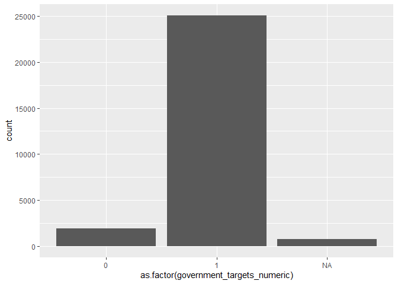
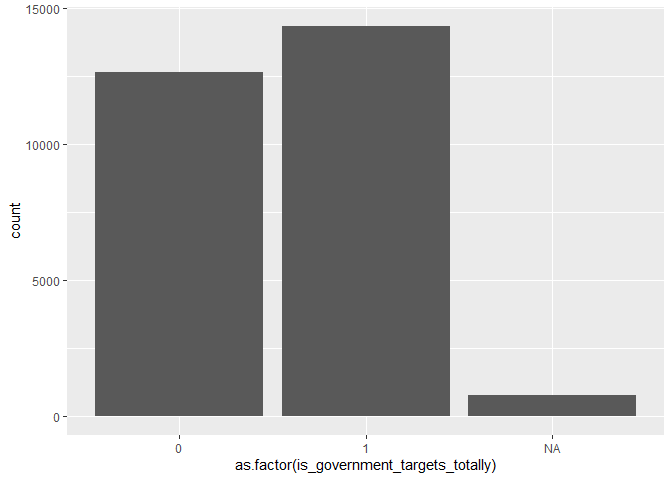

Processing Eurobarometer 87.1 (March 2017)
================
Daniel Antal, CFA
4/27/2020

  - [Setup The Eurobarometer Package](#setup-the-eurobarometer-package)
  - [Read In Data](#read-in-data)
      - [Preprocessing the Eurobarometer 87.1 (March 2017)
        Data](#preprocessing-the-eurobarometer-87.1-march-2017-data)
  - [Simple Models](#simple-models)
      - [Simple GLM model outside
        Poland](#simple-glm-model-outside-poland)
      - [Simple GLM model for Poland](#simple-glm-model-for-poland)
      - [Simple Model With Country
        Effects](#simple-model-with-country-effects)

## Setup The Eurobarometer Package

## Read In Data

You can read in the SPSS file with `haven`, which is part of
`tidyverse`.

``` r
# Change to eval=TRUE if you want to run this code
ZA6595_raw <- haven::read_spss(file.path("not_included", "ZA6595_v3-0-0.sav"))
```

You can analyze the SPSS file with `gesis_metadata_create`.

``` r
# Change to eval=TRUE if you want to run this code
ZA6595_metadata <- gesis_metadata_create(dat = ZA6595_raw)

ZA6595 <- ZA6595_raw %>%
  purrr::set_names ( as.character(ZA6595_metadata$canonical_name)) %>%
  mutate ( region_nuts_names  = haven::as_factor(region_nuts_codes)) %>%
  mutate ( region_nuts_codes =  as.character(region_nuts_codes)) 
```

### Preprocessing the Eurobarometer 87.1 (March 2017) Data

``` r
source(file.path("R", "which_coal_region.R"))
# Change to eval=TRUE if you want to run this code
eb15 <- ZA6595 %>%
  select ( one_of("gvrnmnt_targets_for_renewable_energy_importance",
                  "region_nuts_names", "region_nuts_codes",
                  "age_exact", "age_education", "type_of_community",
                  "age_education_5_cat_recoded",
                  "country_code_iso_3166", 
                  "weight_result_from_target", 
                  "left_right_placement_3_cat_recoded"),
           contains("occupation")) %>%
  dplyr::rename ( w1 = weight_result_from_target ) %>%
   mutate ( government_targets = haven::as_factor(
    gvrnmnt_targets_for_renewable_energy_importance) ) %>%
  mutate ( government_targets_numeric =  case_when (
           grepl("Not very|Not at all", 
                 as.character(government_targets)) ~ 0,
           grepl("Fairly|Very", as.character(government_targets)) ~ 1,
           government_targets == "DK" ~ NA_real_,
           TRUE ~ NA_real_ )
           ) %>%
   mutate ( is_government_targets_totally =  case_when (
           grepl("Fairly|Not very|Not at all", 
                 as.character(government_targets)) ~ 0,
           grepl("Very", as.character(government_targets)) ~ 1,
           government_targets == "DK" ~ NA_real_,
           TRUE ~ NA_real_ )
           ) %>%
  mutate_at ( vars(starts_with("type"),
                   contains("recoded"),
                   contains("occupation")), haven::as_factor) %>%
  mutate ( total_target_agreement_weighted = w1*is_government_targets_totally) %>%
  mutate ( age_education = recode_age_education(var = age_education,
                                                age_exact = age_exact )
           ) %>%
  mutate  ( is_rural = case_when (
    grepl ( "rural", tolower(as.character(type_of_community))) ~ 1,
    grepl ( "town", tolower(as.character(type_of_community)))  ~ 0,
    tolower(as.character(type_of_community)) == "dk" ~ NA_real_,
    TRUE ~ NA_real_)
) %>%
  mutate  ( is_student = case_when (
    grepl ( "studying", tolower(as.character(age_education_5_cat_recoded))) ~ 1,
    grepl ( "refuse", tolower(as.character(type_of_community)))  ~ NA_real_,
    TRUE ~ 0)
  )  %>%
  mutate  ( is_highly_educated = case_when (
    grepl ( "20 years", tolower(as.character(age_education_5_cat_recoded))) ~ 1,
    grepl ( "refuse", tolower(as.character(type_of_community)))  ~ NA_real_,
    TRUE ~ 0)
  ) %>%
  mutate ( year_survey = 2018 ) %>%
  mutate ( coal_region = which_coal_region(region_nuts_codes)) %>%
  mutate ( is_coal_region = ifelse (is.na(coal_region), 0, 1)) %>%
  dplyr::rename ( left_right_3 =  left_right_placement_3_cat_recoded  )

saveRDS(eb15,
        file.path("data", "eb15.rds"), 
        version = 2) # backward compatiblity
```

I created a coal region proxy with this document: [Coal regions in
transition](https://ec.europa.eu/energy/topics/oil-gas-and-coal/EU-coal-regions/coal-regions-transition_en)

## Simple Models

The problem with this variable is that it has very little variance.
Therefore the target variable is not `agreement` but `total agreement`.

``` r
library(ggplot2)

eb15 <- readRDS(file.path("data", "eb15.rds"))


eb15 %>%
  ggplot( data = ., 
          aes ( x= as.factor(government_targets_numeric) )) +
  geom_histogram( stat = "count")
```

    ## Warning: Ignoring unknown parameters: binwidth, bins, pad

<!-- -->

``` r
eb15 %>%
  ggplot( data = ., 
          aes ( x= as.factor(is_government_targets_totally) )) +
  geom_histogram( stat = "count")
```

    ## Warning: Ignoring unknown parameters: binwidth, bins, pad

<!-- -->

### Simple GLM model outside Poland

``` r
summary ( glm ( is_government_targets_totally  ~
                  age_exact + 
                  is_highly_educated +
                  is_coal_region + left_right_3,
                data = filter ( eb15,
                                country_code_iso_3166!= "PL"),
                family = 'binomial'))
```

    ## 
    ## Call:
    ## glm(formula = is_government_targets_totally ~ age_exact + is_highly_educated + 
    ##     is_coal_region + left_right_3, family = "binomial", data = filter(eb15, 
    ##     country_code_iso_3166 != "PL"))
    ## 
    ## Deviance Residuals: 
    ##     Min       1Q   Median       3Q      Max  
    ## -1.4742  -1.1965   0.9266   1.0914   1.3614  
    ## 
    ## Coefficients:
    ##                              Estimate Std. Error z value Pr(>|z|)    
    ## (Intercept)                 0.3770102  0.0487434   7.735 1.04e-14 ***
    ## age_exact                  -0.0017884  0.0007821  -2.287   0.0222 *  
    ## is_highly_educated          0.3357034  0.0294494  11.399  < 2e-16 ***
    ## is_coal_region             -0.2444288  0.0577462  -4.233 2.31e-05 ***
    ## left_right_3(5 - 6) Centre -0.2785821  0.0332004  -8.391  < 2e-16 ***
    ## left_right_3(7 -10) Right  -0.3961916  0.0367020 -10.795  < 2e-16 ***
    ## ---
    ## Signif. codes:  0 '***' 0.001 '**' 0.01 '*' 0.05 '.' 0.1 ' ' 1
    ## 
    ## (Dispersion parameter for binomial family taken to be 1)
    ## 
    ##     Null deviance: 28809  on 20886  degrees of freedom
    ## Residual deviance: 28513  on 20881  degrees of freedom
    ##   (5826 observations deleted due to missingness)
    ## AIC: 28525
    ## 
    ## Number of Fisher Scoring iterations: 4

Support for the target variable
`transition_policy_statements_more_pub_fin_support_for_clean_energy_even_if_fossil_subsidies_reduced`
coded to binary variable (agree, disagree) \* is shrinking with age. \*
less likely to be supported in rural areas, but this is not a
significant variable \* less likely to be supported in coal areas.

### Simple GLM model for Poland

The `coal regions` in Poland are not significant and do not have a
negative coefficient.

``` r
summary ( glm ( is_government_targets_totally ~ 
                  age_exact +
                  is_highly_educated +
                  is_coal_region +left_right_3,
                data = filter ( eb15,
                                country_code_iso_3166 == "PL"),
                family = 'binomial'))
```

    ## 
    ## Call:
    ## glm(formula = is_government_targets_totally ~ age_exact + is_highly_educated + 
    ##     is_coal_region + left_right_3, family = "binomial", data = filter(eb15, 
    ##     country_code_iso_3166 == "PL"))
    ## 
    ## Deviance Residuals: 
    ##     Min       1Q   Median       3Q      Max  
    ## -1.1874  -0.8902  -0.7409   1.3237   1.8266  
    ## 
    ## Coefficients:
    ##                             Estimate Std. Error z value Pr(>|z|)    
    ## (Intercept)                -1.383306   0.343681  -4.025  5.7e-05 ***
    ## age_exact                   0.005429   0.004855   1.118 0.263538    
    ## is_highly_educated          0.184437   0.168898   1.092 0.274832    
    ## is_coal_region              0.554535   0.167412   3.312 0.000925 ***
    ## left_right_3(5 - 6) Centre  0.304004   0.241789   1.257 0.208641    
    ## left_right_3(7 -10) Right  -0.200839   0.243541  -0.825 0.409564    
    ## ---
    ## Signif. codes:  0 '***' 0.001 '**' 0.01 '*' 0.05 '.' 0.1 ' ' 1
    ## 
    ## (Dispersion parameter for binomial family taken to be 1)
    ## 
    ##     Null deviance: 897.35  on 723  degrees of freedom
    ## Residual deviance: 877.06  on 718  degrees of freedom
    ##   (281 observations deleted due to missingness)
    ## AIC: 889.06
    ## 
    ## Number of Fisher Scoring iterations: 4

### Simple Model With Country Effects

The Poland-only model is counterintuitive, becuase in Poland the level
of total agreement is 35% less likely than in the average EU country.

``` r
country_effects_18 <- glm ( is_government_targets_totally ~
                              age_exact + is_highly_educated +
                              left_right_3 +
                              country_code_iso_3166,
                data = eb15,
                family = 'binomial')

summary ( country_effects_18 )
```

    ## 
    ## Call:
    ## glm(formula = is_government_targets_totally ~ age_exact + is_highly_educated + 
    ##     left_right_3 + country_code_iso_3166, family = "binomial", 
    ##     data = eb15)
    ## 
    ## Deviance Residuals: 
    ##     Min       1Q   Median       3Q      Max  
    ## -2.2208  -1.1503   0.7492   1.0834   1.6765  
    ## 
    ## Coefficients:
    ##                               Estimate Std. Error z value Pr(>|z|)    
    ## (Intercept)                  0.2575978  0.0803355   3.207 0.001343 ** 
    ## age_exact                   -0.0023988  0.0008016  -2.993 0.002765 ** 
    ## is_highly_educated           0.2971394  0.0311446   9.541  < 2e-16 ***
    ## left_right_3(5 - 6) Centre  -0.2437508  0.0341130  -7.145 8.97e-13 ***
    ## left_right_3(7 -10) Right   -0.3707093  0.0375696  -9.867  < 2e-16 ***
    ## country_code_iso_3166BE      0.0112715  0.0952805   0.118 0.905831    
    ## country_code_iso_3166BG     -0.3456556  0.1006956  -3.433 0.000598 ***
    ## country_code_iso_3166CY      1.5176133  0.1750386   8.670  < 2e-16 ***
    ## country_code_iso_3166CZ     -0.5610688  0.0979671  -5.727 1.02e-08 ***
    ## country_code_iso_3166DE-E   -0.0691076  0.1164668  -0.593 0.552935    
    ## country_code_iso_3166DE-W    0.2246734  0.0964360   2.330 0.019819 *  
    ## country_code_iso_3166DK      0.3732907  0.0967679   3.858 0.000115 ***
    ## country_code_iso_3166EE     -0.7001254  0.1048564  -6.677 2.44e-11 ***
    ## country_code_iso_3166ES      0.3147718  0.0991323   3.175 0.001497 ** 
    ## country_code_iso_3166FI     -0.0703248  0.0957923  -0.734 0.462864    
    ## country_code_iso_3166FR     -0.2358266  0.0978856  -2.409 0.015987 *  
    ## country_code_iso_3166GB-GBN  0.4729580  0.0979555   4.828 1.38e-06 ***
    ## country_code_iso_3166GB-NIR  0.8950044  0.1675493   5.342 9.21e-08 ***
    ## country_code_iso_3166GR      0.7233693  0.1042174   6.941 3.89e-12 ***
    ## country_code_iso_3166HR      0.0332939  0.0983866   0.338 0.735063    
    ## country_code_iso_3166HU      0.3461440  0.0964786   3.588 0.000334 ***
    ## country_code_iso_3166IE      0.4214456  0.0983166   4.287 1.81e-05 ***
    ## country_code_iso_3166IT      0.0947758  0.1007502   0.941 0.346858    
    ## country_code_iso_3166LT     -0.2314986  0.1021163  -2.267 0.023390 *  
    ## country_code_iso_3166LU      0.3829248  0.1237122   3.095 0.001966 ** 
    ## country_code_iso_3166LV     -0.4907426  0.1030835  -4.761 1.93e-06 ***
    ## country_code_iso_3166MT      1.9017412  0.1942807   9.789  < 2e-16 ***
    ## country_code_iso_3166NL      0.7746898  0.0981370   7.894 2.93e-15 ***
    ## country_code_iso_3166PL     -0.8092110  0.1057922  -7.649 2.02e-14 ***
    ## country_code_iso_3166PT     -0.2555109  0.1046333  -2.442 0.014608 *  
    ## country_code_iso_3166RO      0.1977551  0.1057024   1.871 0.061364 .  
    ## country_code_iso_3166SE      0.5747469  0.0959417   5.991 2.09e-09 ***
    ## country_code_iso_3166SI      0.6512026  0.1165257   5.588 2.29e-08 ***
    ## country_code_iso_3166SK     -0.5179963  0.1006449  -5.147 2.65e-07 ***
    ## ---
    ## Signif. codes:  0 '***' 0.001 '**' 0.01 '*' 0.05 '.' 0.1 ' ' 1
    ## 
    ## (Dispersion parameter for binomial family taken to be 1)
    ## 
    ##     Null deviance: 29858  on 21610  degrees of freedom
    ## Residual deviance: 28366  on 21577  degrees of freedom
    ##   (6107 observations deleted due to missingness)
    ## AIC: 28434
    ## 
    ## Number of Fisher Scoring iterations: 4

A relatively good model takes the rural regions, left-right
self-placement, high education level and countries. In Poland, even
after controlling for high education level, lack of subjective
urbanization and left-right placement, the country effect is
significantly negative.

The coal region effect becomes less significant if we add left-right
self-placement and reletive education level. Those, who do not support
the climate targets tend to be rigth-wing, rural people who are more
concentrated in the coal areas.

``` r
summary ( glm ( is_government_targets_totally  ~
                    left_right_3 +
                    is_coal_region + 
                    is_highly_educated +
                    country_code_iso_3166,
                data = eb15,
                family = 'binomial') 
          )
```

    ## 
    ## Call:
    ## glm(formula = is_government_targets_totally ~ left_right_3 + 
    ##     is_coal_region + is_highly_educated + country_code_iso_3166, 
    ##     family = "binomial", data = eb15)
    ## 
    ## Deviance Residuals: 
    ##     Min       1Q   Median       3Q      Max  
    ## -2.2049  -1.1523   0.7499   1.0808   1.6478  
    ## 
    ## Coefficients:
    ##                              Estimate Std. Error z value Pr(>|z|)    
    ## (Intercept)                  0.142580   0.070553   2.021 0.043291 *  
    ## left_right_3(5 - 6) Centre  -0.241052   0.034090  -7.071 1.54e-12 ***
    ## left_right_3(7 -10) Right   -0.371873   0.037564  -9.900  < 2e-16 ***
    ## is_coal_region               0.055767   0.063530   0.878 0.380055    
    ## is_highly_educated           0.302557   0.031089   9.732  < 2e-16 ***
    ## country_code_iso_3166BE     -0.002942   0.095127  -0.031 0.975325    
    ## country_code_iso_3166BG     -0.351576   0.100683  -3.492 0.000480 ***
    ## country_code_iso_3166CY      1.508788   0.174975   8.623  < 2e-16 ***
    ## country_code_iso_3166CZ     -0.578264   0.099600  -5.806 6.40e-09 ***
    ## country_code_iso_3166DE-E   -0.115550   0.122011  -0.947 0.343614    
    ## country_code_iso_3166DE-W    0.201479   0.097721   2.062 0.039228 *  
    ## country_code_iso_3166DK      0.351329   0.096466   3.642 0.000271 ***
    ## country_code_iso_3166EE     -0.716610   0.104699  -6.845 7.67e-12 ***
    ## country_code_iso_3166ES      0.304133   0.099411   3.059 0.002218 ** 
    ## country_code_iso_3166FI     -0.089404   0.095563  -0.936 0.349504    
    ## country_code_iso_3166FR     -0.249041   0.097752  -2.548 0.010844 *  
    ## country_code_iso_3166GB-GBN  0.460955   0.097826   4.712 2.45e-06 ***
    ## country_code_iso_3166GB-NIR  0.885205   0.167439   5.287 1.25e-07 ***
    ## country_code_iso_3166GR      0.718790   0.104202   6.898 5.27e-12 ***
    ## country_code_iso_3166HR      0.039203   0.098356   0.399 0.690200    
    ## country_code_iso_3166HU      0.336532   0.096408   3.491 0.000482 ***
    ## country_code_iso_3166IE      0.411522   0.098336   4.185 2.85e-05 ***
    ## country_code_iso_3166IT      0.093877   0.100720   0.932 0.351306    
    ## country_code_iso_3166LT     -0.245519   0.101994  -2.407 0.016076 *  
    ## country_code_iso_3166LU      0.373802   0.123662   3.023 0.002505 ** 
    ## country_code_iso_3166LV     -0.493283   0.103072  -4.786 1.70e-06 ***
    ## country_code_iso_3166MT      1.893673   0.194220   9.750  < 2e-16 ***
    ## country_code_iso_3166NL      0.760401   0.097994   7.760 8.52e-15 ***
    ## country_code_iso_3166PL     -0.830996   0.108225  -7.678 1.61e-14 ***
    ## country_code_iso_3166PT     -0.260727   0.104590  -2.493 0.012673 *  
    ## country_code_iso_3166RO      0.196165   0.105823   1.854 0.063781 .  
    ## country_code_iso_3166SE      0.551341   0.095591   5.768 8.04e-09 ***
    ## country_code_iso_3166SI      0.623964   0.116582   5.352 8.69e-08 ***
    ## country_code_iso_3166SK     -0.546189   0.103172  -5.294 1.20e-07 ***
    ## ---
    ## Signif. codes:  0 '***' 0.001 '**' 0.01 '*' 0.05 '.' 0.1 ' ' 1
    ## 
    ## (Dispersion parameter for binomial family taken to be 1)
    ## 
    ##     Null deviance: 29858  on 21610  degrees of freedom
    ## Residual deviance: 28375  on 21577  degrees of freedom
    ##   (6107 observations deleted due to missingness)
    ## AIC: 28443
    ## 
    ## Number of Fisher Scoring iterations: 4
