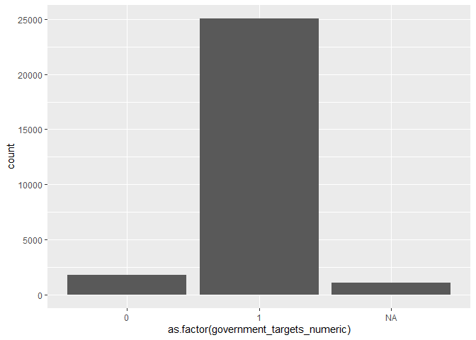
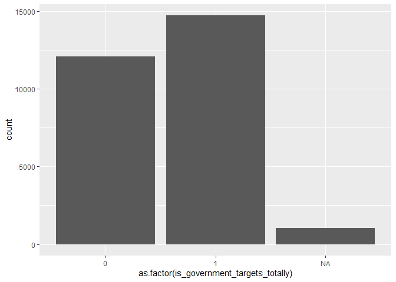
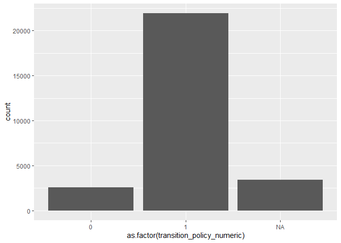
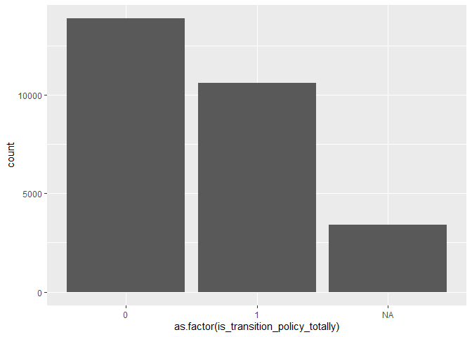

Processing Eurobarometer 87.1 (March 2017)
================
Daniel Antal, CFA
4/27/2020

  - [Setup The Eurobarometer Package](#setup-the-eurobarometer-package)
  - [Read In Data](#read-in-data)
      - [Preprocessing the Eurobarometer 87.1 (March 2017)
        Data](#preprocessing-the-eurobarometer-87.1-march-2017-data)
  - [Simple Models](#simple-models)
      - [Simple GLM model outside
        Poland](#simple-glm-model-outside-poland)
      - [Simple GLM model for Poland](#simple-glm-model-for-poland)
      - [Simple Model With Country
        Effects](#simple-model-with-country-effects)

## Setup The Eurobarometer Package

## Read In Data

You can read in the SPSS file with `haven`, which is part of
`tidyverse`.

``` r
# Change to eval=TRUE if you want to run this code
ZA6861_raw <- haven::read_spss(file.path("not_included", "ZA6861_v1-2-0.sav"))
```

You can analyze the SPSS file with `gesis_metadata_create`.

``` r
# Change to eval=TRUE if you want to run this code
ZA6861_metadata <- gesis_metadata_create(dat = ZA6861_raw)

ZA6861 <- ZA6861_raw %>%
  purrr::set_names ( as.character(ZA6861_metadata$canonical_name)) %>%
  mutate ( region_nuts_names  = haven::as_factor(region_nuts_codes)) %>%
  mutate ( region_nuts_codes =  as.character(region_nuts_codes)) 
```

### Preprocessing the Eurobarometer 87.1 (March 2017) Data

``` r
source(file.path("R", "which_coal_region.R"))
# Change to eval=TRUE if you want to run this code
eb17 <- ZA6861 %>%
  select ( one_of("more_pub_fin_support_for_transition_even_if_cut_subsidies_fossil_fuels",
                  "gvrnmnt_targets_for_renewable_energy_importance",
                  "region_nuts_names", "region_nuts_codes",
                  "age_exact", "age_education", "type_of_community",
                  "age_education_recoded_5_cat",
                  "country_code_iso_3166", 
                  "weight_result_from_target_redressment", 
                  "left_right_placement_recoded_3_cat"),
           contains("occupation")) %>%
  dplyr::rename ( transition_policy  = more_pub_fin_support_for_transition_even_if_cut_subsidies_fossil_fuels, 
                  w1 = weight_result_from_target_redressment ) %>%
  mutate ( transition_policy = haven::as_factor ( transition_policy )) %>%
  mutate ( government_targets = haven::as_factor(
    gvrnmnt_targets_for_renewable_energy_importance) ) %>%
  mutate ( government_targets_numeric =  case_when (
           grepl("Not very|Not at all", 
                 as.character(government_targets)) ~ 0,
           grepl("Fairly|Very", as.character(government_targets)) ~ 1,
           government_targets == "DK" ~ NA_real_,
           TRUE ~ NA_real_ )
           ) %>%
   mutate ( is_government_targets_totally =  case_when (
           grepl("Fairly|Not very|Not at all", 
                 as.character(government_targets)) ~ 0,
           grepl("Very", as.character(government_targets)) ~ 1,
           government_targets == "DK" ~ NA_real_,
           TRUE ~ NA_real_ )
           ) %>%
  mutate_at ( vars(starts_with("type"),
                   contains("recoded"),
                   contains("occupation")), haven::as_factor) %>%
  mutate ( transition_policy_numeric = case_when (
           grepl("Totally agree|Tend to agree",
                 as.character(transition_policy))    ~ 1,
           grepl("disagree", as.character(transition_policy)) ~ 0,
           TRUE ~ NA_real_ )
           ) %>%
  mutate ( is_transition_policy_totally = case_when (
           grepl("Totally agree",
                 as.character(transition_policy))    ~ 1,
           grepl("Tend to|disagree", as.character(transition_policy)) ~ 0,
           TRUE ~ NA_real_ )
           ) %>%
  mutate ( total_agreement_weighted = w1*is_transition_policy_totally) %>%
  mutate ( age_education = recode_age_education(var = age_education,
                                                age_exact = age_exact )
           ) %>%
  mutate  ( is_rural = case_when (
    grepl ( "rural", tolower(as.character(type_of_community))) ~ 1,
    grepl ( "town", tolower(as.character(type_of_community)))  ~ 0,
    tolower(as.character(type_of_community)) == "dk" ~ NA_real_,
    TRUE ~ NA_real_)
) %>%
  mutate  ( is_student = case_when (
    grepl ( "studying", tolower(as.character(age_education_recoded_5_cat))) ~ 1,
    grepl ( "refuse", tolower(as.character(type_of_community)))  ~ NA_real_,
    TRUE ~ 0)
  )  %>%
  mutate  ( is_highly_educated = case_when (
    grepl ( "20 years", tolower(as.character(age_education_recoded_5_cat))) ~ 1,
    grepl ( "refuse", tolower(as.character(type_of_community)))  ~ NA_real_,
    TRUE ~ 0)
  ) %>%
  mutate ( year_survey = 2018 ) %>%
  mutate ( coal_region = which_coal_region(region_nuts_codes)) %>%
  mutate ( is_coal_region = ifelse (is.na(coal_region), 0, 1))

saveRDS(eb17,
        file.path("data", "eb17.rds"), 
        version = 2) # backward compatiblity
```

I created a coal region proxy with this document: [Coal regions in
transition](https://ec.europa.eu/energy/topics/oil-gas-and-coal/EU-coal-regions/coal-regions-transition_en)

## Simple Models

The problem with this variable is that it has very little variance.
Therefore the target variable is not `agreement` but `total agreement`.

``` r
library(ggplot2)

eb17 <- readRDS(file.path("data", "eb17.rds"))


eb17 %>%
  ggplot( data = ., 
          aes ( x= as.factor(government_targets_numeric) )) +
  geom_histogram( stat = "count")
```

    ## Warning: Ignoring unknown parameters: binwidth, bins, pad

<!-- -->

``` r
eb17 %>%
  ggplot( data = ., 
          aes ( x= as.factor(is_government_targets_totally) )) +
  geom_histogram( stat = "count")
```

    ## Warning: Ignoring unknown parameters: binwidth, bins, pad

<!-- -->

``` r
eb17 %>%
  ggplot( data = ., 
          aes ( x= as.factor(transition_policy_numeric) )) +
  geom_histogram( stat = "count")
```

    ## Warning: Ignoring unknown parameters: binwidth, bins, pad

<!-- -->

``` r
eb17 %>%
  ggplot( data = ., 
          aes ( x= as.factor(is_transition_policy_totally ) )) +
  geom_histogram( stat = "count")
```

    ## Warning: Ignoring unknown parameters: binwidth, bins, pad

<!-- -->

### Simple GLM model outside Poland

``` r
summary ( glm ( is_transition_policy_totally ~
                  age_exact + 
                  is_highly_educated +
                  is_coal_region + left_right_placement_recoded_3_cat,
                data = filter ( eb17,
                                country_code_iso_3166!= "PL"),
                family = 'binomial'))
```

    ## 
    ## Call:
    ## glm(formula = is_transition_policy_totally ~ age_exact + is_highly_educated + 
    ##     is_coal_region + left_right_placement_recoded_3_cat, family = "binomial", 
    ##     data = filter(eb17, country_code_iso_3166 != "PL"))
    ## 
    ## Deviance Residuals: 
    ##     Min       1Q   Median       3Q      Max  
    ## -1.2714  -1.0831  -0.9827   1.2518   1.4923  
    ## 
    ## Coefficients:
    ##                                                    Estimate Std. Error z value
    ## (Intercept)                                      -0.0035017  0.0474829  -0.074
    ## age_exact                                        -0.0021968  0.0007362  -2.984
    ## is_highly_educated                                0.2701324  0.0275918   9.790
    ## is_coal_region                                   -0.1790177  0.0564361  -3.172
    ## left_right_placement_recoded_3_cat(5 - 6) Centre -0.3167677  0.0338547  -9.357
    ## left_right_placement_recoded_3_cat(7 -10) Right  -0.3262553  0.0383379  -8.510
    ## left_right_placement_recoded_3_catDK/Refusal     -0.2316480  0.0426245  -5.435
    ##                                                  Pr(>|z|)    
    ## (Intercept)                                       0.94121    
    ## age_exact                                         0.00285 ** 
    ## is_highly_educated                                < 2e-16 ***
    ## is_coal_region                                    0.00151 ** 
    ## left_right_placement_recoded_3_cat(5 - 6) Centre  < 2e-16 ***
    ## left_right_placement_recoded_3_cat(7 -10) Right   < 2e-16 ***
    ## left_right_placement_recoded_3_catDK/Refusal     5.49e-08 ***
    ## ---
    ## Signif. codes:  0 '***' 0.001 '**' 0.01 '*' 0.05 '.' 0.1 ' ' 1
    ## 
    ## (Dispersion parameter for binomial family taken to be 1)
    ## 
    ##     Null deviance: 32350  on 23603  degrees of freedom
    ## Residual deviance: 32115  on 23597  degrees of freedom
    ##   (3289 observations deleted due to missingness)
    ## AIC: 32129
    ## 
    ## Number of Fisher Scoring iterations: 4

And the other policy question:

``` r
summary ( glm ( is_government_targets_totally  ~
                  age_exact + 
                  is_highly_educated +
                  is_coal_region + left_right_placement_recoded_3_cat,
                data = filter ( eb17,
                                country_code_iso_3166!= "PL"),
                family = 'binomial'))
```

    ## 
    ## Call:
    ## glm(formula = is_government_targets_totally ~ age_exact + is_highly_educated + 
    ##     is_coal_region + left_right_placement_recoded_3_cat, family = "binomial", 
    ##     data = filter(eb17, country_code_iso_3166 != "PL"))
    ## 
    ## Deviance Residuals: 
    ##     Min       1Q   Median       3Q      Max  
    ## -1.5274  -1.2119   0.9077   1.1211   1.3741  
    ## 
    ## Coefficients:
    ##                                                    Estimate Std. Error z value
    ## (Intercept)                                       0.4250250  0.0458708   9.266
    ## age_exact                                        -0.0026556  0.0006944  -3.824
    ## is_highly_educated                                0.4266016  0.0269718  15.817
    ## is_coal_region                                   -0.3563669  0.0532233  -6.696
    ## left_right_placement_recoded_3_cat(5 - 6) Centre -0.2300664  0.0330873  -6.953
    ## left_right_placement_recoded_3_cat(7 -10) Right  -0.2704552  0.0373083  -7.249
    ## left_right_placement_recoded_3_catDK/Refusal     -0.2456682  0.0399930  -6.143
    ##                                                  Pr(>|z|)    
    ## (Intercept)                                       < 2e-16 ***
    ## age_exact                                        0.000131 ***
    ## is_highly_educated                                < 2e-16 ***
    ## is_coal_region                                   2.15e-11 ***
    ## left_right_placement_recoded_3_cat(5 - 6) Centre 3.57e-12 ***
    ## left_right_placement_recoded_3_cat(7 -10) Right  4.19e-13 ***
    ## left_right_placement_recoded_3_catDK/Refusal     8.11e-10 ***
    ## ---
    ## Signif. codes:  0 '***' 0.001 '**' 0.01 '*' 0.05 '.' 0.1 ' ' 1
    ## 
    ## (Dispersion parameter for binomial family taken to be 1)
    ## 
    ##     Null deviance: 35579  on 25904  degrees of freedom
    ## Residual deviance: 35163  on 25898  degrees of freedom
    ##   (988 observations deleted due to missingness)
    ## AIC: 35177
    ## 
    ## Number of Fisher Scoring iterations: 4

Support for the target variable
`transition_policy_statements_more_pub_fin_support_for_clean_energy_even_if_fossil_subsidies_reduced`
coded to binary variable (agree, disagree) \* is shrinking with age. \*
less likely to be supported in rural areas, but this is not a
significant variable \* less likely to be supported in coal areas.

### Simple GLM model for Poland

The `coal regions` in Poland are not significant and do not have a
negative coefficient.

``` r
summary ( glm ( is_transition_policy_totally ~ 
                  age_exact + 
                  is_highly_educated +
                  is_coal_region + left_right_placement_recoded_3_cat,
                data = filter ( eb17,
                                country_code_iso_3166 == "PL"),
                family = 'binomial'))
```

    ## 
    ## Call:
    ## glm(formula = is_transition_policy_totally ~ age_exact + is_highly_educated + 
    ##     is_coal_region + left_right_placement_recoded_3_cat, family = "binomial", 
    ##     data = filter(eb17, country_code_iso_3166 == "PL"))
    ## 
    ## Deviance Residuals: 
    ##     Min       1Q   Median       3Q      Max  
    ## -1.0403  -0.8956  -0.8205   1.4151   1.6912  
    ## 
    ## Coefficients:
    ##                                                    Estimate Std. Error z value
    ## (Intercept)                                      -0.5383282  0.2993006  -1.799
    ## age_exact                                         0.0004487  0.0042048   0.107
    ## is_highly_educated                                0.1714576  0.1464509   1.171
    ## is_coal_region                                   -0.2281325  0.1528770  -1.492
    ## left_right_placement_recoded_3_cat(5 - 6) Centre -0.3987071  0.2119154  -1.881
    ## left_right_placement_recoded_3_cat(7 -10) Right  -0.1988399  0.2129801  -0.934
    ## left_right_placement_recoded_3_catDK/Refusal     -0.1704760  0.2274480  -0.750
    ##                                                  Pr(>|z|)  
    ## (Intercept)                                        0.0721 .
    ## age_exact                                          0.9150  
    ## is_highly_educated                                 0.2417  
    ## is_coal_region                                     0.1356  
    ## left_right_placement_recoded_3_cat(5 - 6) Centre   0.0599 .
    ## left_right_placement_recoded_3_cat(7 -10) Right    0.3505  
    ## left_right_placement_recoded_3_catDK/Refusal       0.4535  
    ## ---
    ## Signif. codes:  0 '***' 0.001 '**' 0.01 '*' 0.05 '.' 0.1 ' ' 1
    ## 
    ## (Dispersion parameter for binomial family taken to be 1)
    ## 
    ##     Null deviance: 1131.3  on 897  degrees of freedom
    ## Residual deviance: 1123.5  on 891  degrees of freedom
    ##   (110 observations deleted due to missingness)
    ## AIC: 1137.5
    ## 
    ## Number of Fisher Scoring iterations: 4

And probably this question is less well understood:

``` r
summary ( glm ( is_government_targets_totally ~ 
                  age_exact +
                  is_highly_educated +
                  is_coal_region +left_right_placement_recoded_3_cat,
                data = filter ( eb17,
                                country_code_iso_3166 == "PL"),
                family = 'binomial'))
```

    ## 
    ## Call:
    ## glm(formula = is_government_targets_totally ~ age_exact + is_highly_educated + 
    ##     is_coal_region + left_right_placement_recoded_3_cat, family = "binomial", 
    ##     data = filter(eb17, country_code_iso_3166 == "PL"))
    ## 
    ## Deviance Residuals: 
    ##     Min       1Q   Median       3Q      Max  
    ## -1.1285  -0.9424  -0.8309   1.3924   1.6615  
    ## 
    ## Coefficients:
    ##                                                   Estimate Std. Error z value
    ## (Intercept)                                      -0.824202   0.288556  -2.856
    ## age_exact                                         0.003762   0.004008   0.939
    ## is_highly_educated                                0.141105   0.141940   0.994
    ## is_coal_region                                    0.199516   0.146172   1.365
    ## left_right_placement_recoded_3_cat(5 - 6) Centre -0.349073   0.207595  -1.682
    ## left_right_placement_recoded_3_cat(7 -10) Right   0.036379   0.206043   0.177
    ## left_right_placement_recoded_3_catDK/Refusal     -0.309996   0.221644  -1.399
    ##                                                  Pr(>|z|)   
    ## (Intercept)                                       0.00429 **
    ## age_exact                                         0.34797   
    ## is_highly_educated                                0.32016   
    ## is_coal_region                                    0.17227   
    ## left_right_placement_recoded_3_cat(5 - 6) Centre  0.09266 . 
    ## left_right_placement_recoded_3_cat(7 -10) Right   0.85985   
    ## left_right_placement_recoded_3_catDK/Refusal      0.16193   
    ## ---
    ## Signif. codes:  0 '***' 0.001 '**' 0.01 '*' 0.05 '.' 0.1 ' ' 1
    ## 
    ## (Dispersion parameter for binomial family taken to be 1)
    ## 
    ##     Null deviance: 1202.2  on 938  degrees of freedom
    ## Residual deviance: 1191.8  on 932  degrees of freedom
    ##   (69 observations deleted due to missingness)
    ## AIC: 1205.8
    ## 
    ## Number of Fisher Scoring iterations: 4

### Simple Model With Country Effects

The Poland-only model is counterintuitive, becuase in Poland the level
of total agreement is 35% less likely than in the average EU country.

``` r
country_effects_18 <- glm ( is_transition_policy_totally ~
                              age_exact + 
                              is_highly_educated +
                              left_right_placement_recoded_3_cat +
                              country_code_iso_3166,
                data = eb17,
                family = 'binomial')

summary ( country_effects_18 )
```

    ## 
    ## Call:
    ## glm(formula = is_transition_policy_totally ~ age_exact + is_highly_educated + 
    ##     left_right_placement_recoded_3_cat + country_code_iso_3166, 
    ##     family = "binomial", data = eb17)
    ## 
    ## Deviance Residuals: 
    ##     Min       1Q   Median       3Q      Max  
    ## -1.5891  -1.0506  -0.8682   1.2415   1.6522  
    ## 
    ## Coefficients:
    ##                                                    Estimate Std. Error z value
    ## (Intercept)                                      -0.1299929  0.0791332  -1.643
    ## age_exact                                        -0.0031731  0.0007466  -4.250
    ## is_highly_educated                                0.2264631  0.0287843   7.868
    ## left_right_placement_recoded_3_cat(5 - 6) Centre -0.2581236  0.0342632  -7.534
    ## left_right_placement_recoded_3_cat(7 -10) Right  -0.2661922  0.0386059  -6.895
    ## left_right_placement_recoded_3_catDK/Refusal     -0.2188148  0.0435794  -5.021
    ## country_code_iso_3166BE                          -0.3383072  0.0956452  -3.537
    ## country_code_iso_3166BG                           0.0833696  0.0990010   0.842
    ## country_code_iso_3166CY                           0.7767944  0.1184282   6.559
    ## country_code_iso_3166CZ                          -0.4185518  0.0980816  -4.267
    ## country_code_iso_3166DE-E                        -0.1155828  0.1161598  -0.995
    ## country_code_iso_3166DE-W                         0.2399700  0.0935340   2.566
    ## country_code_iso_3166DK                           0.3597879  0.0961656   3.741
    ## country_code_iso_3166EE                          -0.2913228  0.1025570  -2.841
    ## country_code_iso_3166ES                           0.7752957  0.0952366   8.141
    ## country_code_iso_3166FI                           0.1276093  0.0945538   1.350
    ## country_code_iso_3166FR                          -0.0413943  0.0967586  -0.428
    ## country_code_iso_3166GB-GBN                       0.0622094  0.0957639   0.650
    ## country_code_iso_3166GB-NIR                      -0.2225664  0.1514850  -1.469
    ## country_code_iso_3166GR                           0.1381847  0.0938153   1.473
    ## country_code_iso_3166HR                          -0.0442301  0.0939081  -0.471
    ## country_code_iso_3166HU                           0.3039832  0.0928973   3.272
    ## country_code_iso_3166IE                           0.3076027  0.0932607   3.298
    ## country_code_iso_3166IT                           0.1206259  0.0956834   1.261
    ## country_code_iso_3166LT                           0.0546890  0.0969007   0.564
    ## country_code_iso_3166LU                          -0.1029873  0.1199775  -0.858
    ## country_code_iso_3166LV                          -0.3608084  0.1017967  -3.544
    ## country_code_iso_3166MT                           0.3329667  0.1155416   2.882
    ## country_code_iso_3166NL                           0.4674409  0.0932902   5.011
    ## country_code_iso_3166PL                          -0.3535229  0.0980217  -3.607
    ## country_code_iso_3166PT                           0.5033240  0.0942175   5.342
    ## country_code_iso_3166RO                          -0.0604753  0.0955368  -0.633
    ## country_code_iso_3166SE                           0.9159736  0.0963053   9.511
    ## country_code_iso_3166SI                           0.3783215  0.0937410   4.036
    ## country_code_iso_3166SK                          -0.2397621  0.1006482  -2.382
    ##                                                  Pr(>|z|)    
    ## (Intercept)                                      0.100443    
    ## age_exact                                        2.14e-05 ***
    ## is_highly_educated                               3.62e-15 ***
    ## left_right_placement_recoded_3_cat(5 - 6) Centre 4.94e-14 ***
    ## left_right_placement_recoded_3_cat(7 -10) Right  5.38e-12 ***
    ## left_right_placement_recoded_3_catDK/Refusal     5.14e-07 ***
    ## country_code_iso_3166BE                          0.000405 ***
    ## country_code_iso_3166BG                          0.399727    
    ## country_code_iso_3166CY                          5.41e-11 ***
    ## country_code_iso_3166CZ                          1.98e-05 ***
    ## country_code_iso_3166DE-E                        0.319720    
    ## country_code_iso_3166DE-W                        0.010300 *  
    ## country_code_iso_3166DK                          0.000183 ***
    ## country_code_iso_3166EE                          0.004503 ** 
    ## country_code_iso_3166ES                          3.93e-16 ***
    ## country_code_iso_3166FI                          0.177146    
    ## country_code_iso_3166FR                          0.668789    
    ## country_code_iso_3166GB-GBN                      0.515943    
    ## country_code_iso_3166GB-NIR                      0.141770    
    ## country_code_iso_3166GR                          0.140766    
    ## country_code_iso_3166HR                          0.637645    
    ## country_code_iso_3166HU                          0.001067 ** 
    ## country_code_iso_3166IE                          0.000973 ***
    ## country_code_iso_3166IT                          0.207425    
    ## country_code_iso_3166LT                          0.572494    
    ## country_code_iso_3166LU                          0.390678    
    ## country_code_iso_3166LV                          0.000394 ***
    ## country_code_iso_3166MT                          0.003954 ** 
    ## country_code_iso_3166NL                          5.43e-07 ***
    ## country_code_iso_3166PL                          0.000310 ***
    ## country_code_iso_3166PT                          9.19e-08 ***
    ## country_code_iso_3166RO                          0.526730    
    ## country_code_iso_3166SE                           < 2e-16 ***
    ## country_code_iso_3166SI                          5.44e-05 ***
    ## country_code_iso_3166SK                          0.017211 *  
    ## ---
    ## Signif. codes:  0 '***' 0.001 '**' 0.01 '*' 0.05 '.' 0.1 ' ' 1
    ## 
    ## (Dispersion parameter for binomial family taken to be 1)
    ## 
    ##     Null deviance: 33528  on 24501  degrees of freedom
    ## Residual deviance: 32624  on 24467  degrees of freedom
    ##   (3399 observations deleted due to missingness)
    ## AIC: 32694
    ## 
    ## Number of Fisher Scoring iterations: 4

For the government targets the Polish hostility is even more pronounced:

``` r
country_effects_18 <- glm ( is_government_targets_totally ~
                              age_exact + is_highly_educated +
                              left_right_placement_recoded_3_cat +
                              country_code_iso_3166,
                data = eb17,
                family = 'binomial')

summary ( country_effects_18 )
```

    ## 
    ## Call:
    ## glm(formula = is_government_targets_totally ~ age_exact + is_highly_educated + 
    ##     left_right_placement_recoded_3_cat + country_code_iso_3166, 
    ##     family = "binomial", data = eb17)
    ## 
    ## Deviance Residuals: 
    ##     Min       1Q   Median       3Q      Max  
    ## -2.0018  -1.1545   0.7362   1.0824   1.6269  
    ## 
    ## Coefficients:
    ##                                                    Estimate Std. Error z value
    ## (Intercept)                                       0.3388639  0.0769143   4.406
    ## age_exact                                        -0.0038950  0.0007127  -5.465
    ## is_highly_educated                                0.3306544  0.0282565  11.702
    ## left_right_placement_recoded_3_cat(5 - 6) Centre -0.1969529  0.0337997  -5.827
    ## left_right_placement_recoded_3_cat(7 -10) Right  -0.2133986  0.0379393  -5.625
    ## left_right_placement_recoded_3_catDK/Refusal     -0.2155757  0.0413108  -5.218
    ## country_code_iso_3166BE                          -0.0351350  0.0902579  -0.389
    ## country_code_iso_3166BG                          -0.1987590  0.0939227  -2.116
    ## country_code_iso_3166CY                           1.4875503  0.1354609  10.981
    ## country_code_iso_3166CZ                          -0.6162730  0.0918498  -6.710
    ## country_code_iso_3166DE-E                        -0.3527793  0.1117827  -3.156
    ## country_code_iso_3166DE-W                         0.0122427  0.0909626   0.135
    ## country_code_iso_3166DK                           0.8828260  0.0992797   8.892
    ## country_code_iso_3166EE                          -0.4045482  0.0931347  -4.344
    ## country_code_iso_3166ES                           0.3290860  0.0919716   3.578
    ## country_code_iso_3166FI                          -0.1160977  0.0911503  -1.274
    ## country_code_iso_3166FR                          -0.0310532  0.0911773  -0.341
    ## country_code_iso_3166GB-GBN                       0.5227723  0.0932234   5.608
    ## country_code_iso_3166GB-NIR                       0.4363318  0.1366976   3.192
    ## country_code_iso_3166GR                           0.5320792  0.0928206   5.732
    ## country_code_iso_3166HR                          -0.0434732  0.0898932  -0.484
    ## country_code_iso_3166HU                           0.2687819  0.0903204   2.976
    ## country_code_iso_3166IE                           0.4814027  0.0927566   5.190
    ## country_code_iso_3166IT                          -0.2266513  0.0916499  -2.473
    ## country_code_iso_3166LT                          -0.1294877  0.0917066  -1.412
    ## country_code_iso_3166LU                           0.2382339  0.1118715   2.130
    ## country_code_iso_3166LV                          -0.3228008  0.0921081  -3.505
    ## country_code_iso_3166MT                           0.6269849  0.1149103   5.456
    ## country_code_iso_3166NL                           0.9510872  0.0980385   9.701
    ## country_code_iso_3166PL                          -0.8004072  0.0949630  -8.429
    ## country_code_iso_3166PT                          -0.0790378  0.0901115  -0.877
    ## country_code_iso_3166RO                           0.1253190  0.0910246   1.377
    ## country_code_iso_3166SE                           0.7467920  0.0968768   7.709
    ## country_code_iso_3166SI                           0.7422049  0.0942239   7.877
    ## country_code_iso_3166SK                          -0.7902578  0.0954815  -8.277
    ##                                                  Pr(>|z|)    
    ## (Intercept)                                      1.05e-05 ***
    ## age_exact                                        4.62e-08 ***
    ## is_highly_educated                                < 2e-16 ***
    ## left_right_placement_recoded_3_cat(5 - 6) Centre 5.64e-09 ***
    ## left_right_placement_recoded_3_cat(7 -10) Right  1.86e-08 ***
    ## left_right_placement_recoded_3_catDK/Refusal     1.80e-07 ***
    ## country_code_iso_3166BE                          0.697074    
    ## country_code_iso_3166BG                          0.034328 *  
    ## country_code_iso_3166CY                           < 2e-16 ***
    ## country_code_iso_3166CZ                          1.95e-11 ***
    ## country_code_iso_3166DE-E                        0.001600 ** 
    ## country_code_iso_3166DE-W                        0.892935    
    ## country_code_iso_3166DK                           < 2e-16 ***
    ## country_code_iso_3166EE                          1.40e-05 ***
    ## country_code_iso_3166ES                          0.000346 ***
    ## country_code_iso_3166FI                          0.202771    
    ## country_code_iso_3166FR                          0.733419    
    ## country_code_iso_3166GB-GBN                      2.05e-08 ***
    ## country_code_iso_3166GB-NIR                      0.001413 ** 
    ## country_code_iso_3166GR                          9.91e-09 ***
    ## country_code_iso_3166HR                          0.628663    
    ## country_code_iso_3166HU                          0.002922 ** 
    ## country_code_iso_3166IE                          2.10e-07 ***
    ## country_code_iso_3166IT                          0.013398 *  
    ## country_code_iso_3166LT                          0.157956    
    ## country_code_iso_3166LU                          0.033210 *  
    ## country_code_iso_3166LV                          0.000457 ***
    ## country_code_iso_3166MT                          4.86e-08 ***
    ## country_code_iso_3166NL                           < 2e-16 ***
    ## country_code_iso_3166PL                           < 2e-16 ***
    ## country_code_iso_3166PT                          0.380427    
    ## country_code_iso_3166RO                          0.168587    
    ## country_code_iso_3166SE                          1.27e-14 ***
    ## country_code_iso_3166SI                          3.35e-15 ***
    ## country_code_iso_3166SK                           < 2e-16 ***
    ## ---
    ## Signif. codes:  0 '***' 0.001 '**' 0.01 '*' 0.05 '.' 0.1 ' ' 1
    ## 
    ## (Dispersion parameter for binomial family taken to be 1)
    ## 
    ##     Null deviance: 36956  on 26843  degrees of freedom
    ## Residual deviance: 35106  on 26809  degrees of freedom
    ##   (1057 observations deleted due to missingness)
    ## AIC: 35176
    ## 
    ## Number of Fisher Scoring iterations: 4

A relatively good model takes the rural regions, left-right
self-placement, high education level and countries. In Poland, even
after controlling for high education level, lack of subjective
urbanization and left-right placement, the country effect is
significantly negative.

The coal region effect becomes less significant if we add left-right
self-placement and reletive education level. Those, who do not support
the climate targets tend to be rigth-wing, rural people who are more
concentrated in the coal areas.

``` r
summary ( glm ( is_transition_policy_totally  ~
                  age_exact +
                  is_coal_region + 
                  is_highly_educated +
                  left_right_placement_recoded_3_cat +
                  country_code_iso_3166,
                data = eb17,
                family = 'binomial') 
          )
```

    ## 
    ## Call:
    ## glm(formula = is_transition_policy_totally ~ age_exact + is_coal_region + 
    ##     is_highly_educated + left_right_placement_recoded_3_cat + 
    ##     country_code_iso_3166, family = "binomial", data = eb17)
    ## 
    ## Deviance Residuals: 
    ##     Min       1Q   Median       3Q      Max  
    ## -1.5891  -1.0505  -0.8661   1.2410   1.6779  
    ## 
    ## Coefficients:
    ##                                                    Estimate Std. Error z value
    ## (Intercept)                                      -0.1291779  0.0791360  -1.632
    ## age_exact                                        -0.0031864  0.0007468  -4.267
    ## is_coal_region                                   -0.0785050  0.0596452  -1.316
    ## is_highly_educated                                0.2256716  0.0287906   7.838
    ## left_right_placement_recoded_3_cat(5 - 6) Centre -0.2582292  0.0342655  -7.536
    ## left_right_placement_recoded_3_cat(7 -10) Right  -0.2659187  0.0386087  -6.888
    ## left_right_placement_recoded_3_catDK/Refusal     -0.2185334  0.0435829  -5.014
    ## country_code_iso_3166BE                          -0.3381157  0.0956446  -3.535
    ## country_code_iso_3166BG                           0.0833241  0.0990002   0.842
    ## country_code_iso_3166CY                           0.7767584  0.1184276   6.559
    ## country_code_iso_3166CZ                          -0.3966725  0.0994555  -3.988
    ## country_code_iso_3166DE-E                        -0.0730712  0.1205540  -0.606
    ## country_code_iso_3166DE-W                         0.2564127  0.0943622   2.717
    ## country_code_iso_3166DK                           0.3602428  0.0961657   3.746
    ## country_code_iso_3166EE                          -0.2911128  0.1025563  -2.839
    ## country_code_iso_3166ES                           0.7831890  0.0954312   8.207
    ## country_code_iso_3166FI                           0.1279305  0.0945535   1.353
    ## country_code_iso_3166FR                          -0.0412814  0.0967578  -0.427
    ## country_code_iso_3166GB-GBN                       0.0623228  0.0957632   0.651
    ## country_code_iso_3166GB-NIR                      -0.2224959  0.1514840  -1.469
    ## country_code_iso_3166GR                           0.1401906  0.0938273   1.494
    ## country_code_iso_3166HR                          -0.0443632  0.0939076  -0.472
    ## country_code_iso_3166HU                           0.3039242  0.0928968   3.272
    ## country_code_iso_3166IE                           0.3140510  0.0933911   3.363
    ## country_code_iso_3166IT                           0.1204998  0.0956828   1.259
    ## country_code_iso_3166LT                           0.0548609  0.0969000   0.566
    ## country_code_iso_3166LU                          -0.1027811  0.1199767  -0.857
    ## country_code_iso_3166LV                          -0.3607215  0.1017960  -3.544
    ## country_code_iso_3166MT                           0.3329436  0.1155411   2.882
    ## country_code_iso_3166NL                           0.4677072  0.0932898   5.013
    ## country_code_iso_3166PL                          -0.3253228  0.1003020  -3.243
    ## country_code_iso_3166PT                           0.5032240  0.0942170   5.341
    ## country_code_iso_3166RO                          -0.0528374  0.0957155  -0.552
    ## country_code_iso_3166SE                           0.9164168  0.0963057   9.516
    ## country_code_iso_3166SI                           0.3912787  0.0942615   4.151
    ## country_code_iso_3166SK                          -0.2134080  0.1025985  -2.080
    ##                                                  Pr(>|z|)    
    ## (Intercept)                                      0.102605    
    ## age_exact                                        1.98e-05 ***
    ## is_coal_region                                   0.188107    
    ## is_highly_educated                               4.56e-15 ***
    ## left_right_placement_recoded_3_cat(5 - 6) Centre 4.84e-14 ***
    ## left_right_placement_recoded_3_cat(7 -10) Right  5.68e-12 ***
    ## left_right_placement_recoded_3_catDK/Refusal     5.33e-07 ***
    ## country_code_iso_3166BE                          0.000408 ***
    ## country_code_iso_3166BG                          0.399981    
    ## country_code_iso_3166CY                          5.42e-11 ***
    ## country_code_iso_3166CZ                          6.65e-05 ***
    ## country_code_iso_3166DE-E                        0.544429    
    ## country_code_iso_3166DE-W                        0.006581 ** 
    ## country_code_iso_3166DK                          0.000180 ***
    ## country_code_iso_3166EE                          0.004532 ** 
    ## country_code_iso_3166ES                          2.27e-16 ***
    ## country_code_iso_3166FI                          0.176057    
    ## country_code_iso_3166FR                          0.669637    
    ## country_code_iso_3166GB-GBN                      0.515175    
    ## country_code_iso_3166GB-NIR                      0.141894    
    ## country_code_iso_3166GR                          0.135140    
    ## country_code_iso_3166HR                          0.636632    
    ## country_code_iso_3166HU                          0.001069 ** 
    ## country_code_iso_3166IE                          0.000772 ***
    ## country_code_iso_3166IT                          0.207898    
    ## country_code_iso_3166LT                          0.571285    
    ## country_code_iso_3166LU                          0.391624    
    ## country_code_iso_3166LV                          0.000395 ***
    ## country_code_iso_3166MT                          0.003957 ** 
    ## country_code_iso_3166NL                          5.35e-07 ***
    ## country_code_iso_3166PL                          0.001181 ** 
    ## country_code_iso_3166PT                          9.24e-08 ***
    ## country_code_iso_3166RO                          0.580931    
    ## country_code_iso_3166SE                           < 2e-16 ***
    ## country_code_iso_3166SI                          3.31e-05 ***
    ## country_code_iso_3166SK                          0.037523 *  
    ## ---
    ## Signif. codes:  0 '***' 0.001 '**' 0.01 '*' 0.05 '.' 0.1 ' ' 1
    ## 
    ## (Dispersion parameter for binomial family taken to be 1)
    ## 
    ##     Null deviance: 33528  on 24501  degrees of freedom
    ## Residual deviance: 32622  on 24466  degrees of freedom
    ##   (3399 observations deleted due to missingness)
    ## AIC: 32694
    ## 
    ## Number of Fisher Scoring iterations: 4

``` r
summary ( glm ( is_government_targets_totally  ~
                    left_right_placement_recoded_3_cat +
                    is_coal_region + 
                    is_highly_educated +
                    country_code_iso_3166,
                data = eb17,
                family = 'binomial') 
          )
```

    ## 
    ## Call:
    ## glm(formula = is_government_targets_totally ~ left_right_placement_recoded_3_cat + 
    ##     is_coal_region + is_highly_educated + country_code_iso_3166, 
    ##     family = "binomial", data = eb17)
    ## 
    ## Deviance Residuals: 
    ##    Min      1Q  Median      3Q     Max  
    ## -1.961  -1.152   0.728   1.087   1.564  
    ## 
    ## Coefficients:
    ##                                                   Estimate Std. Error z value
    ## (Intercept)                                       0.143829   0.068071   2.113
    ## left_right_placement_recoded_3_cat(5 - 6) Centre -0.193710   0.033767  -5.737
    ## left_right_placement_recoded_3_cat(7 -10) Right  -0.217683   0.037913  -5.742
    ## left_right_placement_recoded_3_catDK/Refusal     -0.203652   0.041216  -4.941
    ## is_coal_region                                   -0.001545   0.057256  -0.027
    ## is_highly_educated                                0.339927   0.028188  12.059
    ## country_code_iso_3166BE                          -0.049914   0.090146  -0.554
    ## country_code_iso_3166BG                          -0.195190   0.093900  -2.079
    ## country_code_iso_3166CY                           1.474782   0.135364  10.895
    ## country_code_iso_3166CZ                          -0.608659   0.093178  -6.532
    ## country_code_iso_3166DE-E                        -0.378372   0.115661  -3.271
    ## country_code_iso_3166DE-W                        -0.003808   0.091601  -0.042
    ## country_code_iso_3166DK                           0.853647   0.099079   8.616
    ## country_code_iso_3166EE                          -0.431177   0.092956  -4.639
    ## country_code_iso_3166ES                           0.327313   0.092067   3.555
    ## country_code_iso_3166FI                          -0.142785   0.090964  -1.570
    ## country_code_iso_3166FR                          -0.043887   0.091078  -0.482
    ## country_code_iso_3166GB-GBN                       0.503004   0.093064   5.405
    ## country_code_iso_3166GB-NIR                       0.422960   0.136567   3.097
    ## country_code_iso_3166GR                           0.528433   0.092751   5.697
    ## country_code_iso_3166HR                          -0.027046   0.089798  -0.301
    ## country_code_iso_3166HU                           0.254017   0.090229   2.815
    ## country_code_iso_3166IE                           0.480008   0.092828   5.171
    ## country_code_iso_3166IT                          -0.225713   0.091592  -2.464
    ## country_code_iso_3166LT                          -0.157620   0.091508  -1.722
    ## country_code_iso_3166LU                           0.227114   0.111773   2.032
    ## country_code_iso_3166LV                          -0.321731   0.092073  -3.494
    ## country_code_iso_3166MT                           0.602893   0.114728   5.255
    ## country_code_iso_3166NL                           0.935717   0.097942   9.554
    ## country_code_iso_3166PL                          -0.799359   0.097026  -8.239
    ## country_code_iso_3166PT                          -0.080651   0.090048  -0.896
    ## country_code_iso_3166RO                           0.139565   0.091138   1.531
    ## country_code_iso_3166SE                           0.708929   0.096564   7.342
    ## country_code_iso_3166SI                           0.724211   0.094576   7.657
    ## country_code_iso_3166SK                          -0.795623   0.097374  -8.171
    ##                                                  Pr(>|z|)    
    ## (Intercept)                                      0.034606 *  
    ## left_right_placement_recoded_3_cat(5 - 6) Centre 9.66e-09 ***
    ## left_right_placement_recoded_3_cat(7 -10) Right  9.38e-09 ***
    ## left_right_placement_recoded_3_catDK/Refusal     7.77e-07 ***
    ## is_coal_region                                   0.978469    
    ## is_highly_educated                                < 2e-16 ***
    ## country_code_iso_3166BE                          0.579781    
    ## country_code_iso_3166BG                          0.037645 *  
    ## country_code_iso_3166CY                           < 2e-16 ***
    ## country_code_iso_3166CZ                          6.48e-11 ***
    ## country_code_iso_3166DE-E                        0.001070 ** 
    ## country_code_iso_3166DE-W                        0.966839    
    ## country_code_iso_3166DK                           < 2e-16 ***
    ## country_code_iso_3166EE                          3.51e-06 ***
    ## country_code_iso_3166ES                          0.000378 ***
    ## country_code_iso_3166FI                          0.116490    
    ## country_code_iso_3166FR                          0.629906    
    ## country_code_iso_3166GB-GBN                      6.48e-08 ***
    ## country_code_iso_3166GB-NIR                      0.001954 ** 
    ## country_code_iso_3166GR                          1.22e-08 ***
    ## country_code_iso_3166HR                          0.763270    
    ## country_code_iso_3166HU                          0.004874 ** 
    ## country_code_iso_3166IE                          2.33e-07 ***
    ## country_code_iso_3166IT                          0.013727 *  
    ## country_code_iso_3166LT                          0.084984 .  
    ## country_code_iso_3166LU                          0.042161 *  
    ## country_code_iso_3166LV                          0.000475 ***
    ## country_code_iso_3166MT                          1.48e-07 ***
    ## country_code_iso_3166NL                           < 2e-16 ***
    ## country_code_iso_3166PL                           < 2e-16 ***
    ## country_code_iso_3166PT                          0.370441    
    ## country_code_iso_3166RO                          0.125683    
    ## country_code_iso_3166SE                          2.11e-13 ***
    ## country_code_iso_3166SI                          1.90e-14 ***
    ## country_code_iso_3166SK                          3.06e-16 ***
    ## ---
    ## Signif. codes:  0 '***' 0.001 '**' 0.01 '*' 0.05 '.' 0.1 ' ' 1
    ## 
    ## (Dispersion parameter for binomial family taken to be 1)
    ## 
    ##     Null deviance: 36956  on 26843  degrees of freedom
    ## Residual deviance: 35136  on 26809  degrees of freedom
    ##   (1057 observations deleted due to missingness)
    ## AIC: 35206
    ## 
    ## Number of Fisher Scoring iterations: 4
